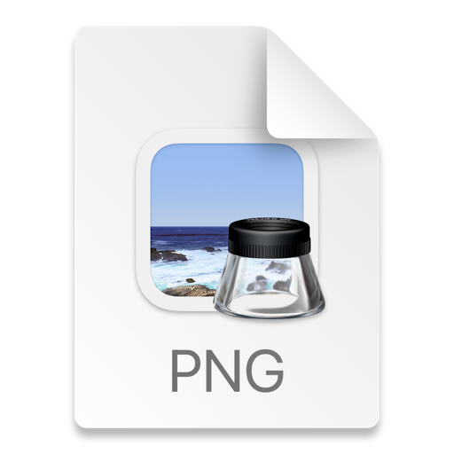

# 종설 백엔드 최종 정리

Oracle OpenJDK 17, Spring Boot 3.4.4

Redis(for Queue), Mosquitto, AWS SDK, RDS for MySQL

IntelliJ, DataGrip, Postman, RestDocs

Github for Version Control (Issue & PR)

## API Document

http://54.172.64.98:8080/docs/index.html

# 시스템 아키텍쳐

# 시퀸스 다이어그램

# 세부 기능 내용

- **공유갤러리 기능 개발**

다수의 사용자가 하나의 갤러리를 공유하는 기능 구현

- S3를 활용하여 최소한의 비용으로 사진을 저장하고, CDN의 역할 또한 수행할 수 있도록 구현
- S3 Presigned URL을 사용하여 클라이언트가 직접 사진을 업로드 하여 서버로 사진을 이동하는 불필요한 통신 제거
- 다수 사용자 간 동기화 문제 해결을 위한 로직 구현

1. 동기화 로그 테이블을 생성하여 사용자 최종 갱신 시점 이후의 갱신 내역을 기반으로 업데이트 하도록 구현

2. Redis Queue를 사용하여 업로드 및 삭제 요청을 동기적으로 처리하도록 하여 동시성 문제 해결

- **Mosquitto MQTT 기반 서버 <-> IoT디바이스 pub/sub 개발**

라즈베리파이 기반 디바이스에 이벤트를 전송하기 위해 저전력 하드웨어를 위한 경량 메시지 서비스인 MQTT를 사용

서버를 Publisher, 라즈베리파이 디바이스를 Subscriber로 하여 공유갤러리 갱신 및 일정 알림시 디바이스에 실시간으로 알림이 전송되도록 구현

- **낙상 및 장시간 미움직임시 보호자 알림 기능 개발**

온디바이스 모델이 특정 이벤트 감지 시 보호자에게 알림이 가도록 개발

- 이벤트 수신 후 오류로 인해 사용자에게 알림이 가지 않는 경우가 치명적으로 생각하여 처리 실패시 로컬 큐에 저장하여 3회 재처리 하도록 구현

FCM을 활용하여 사용자 모바일 디바이스로 실시간 알림이 갈 수 있도록 구현