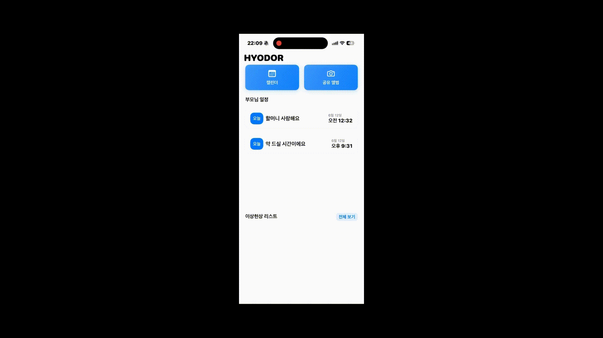
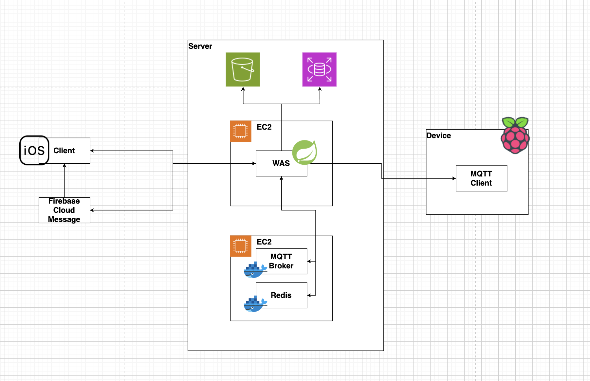
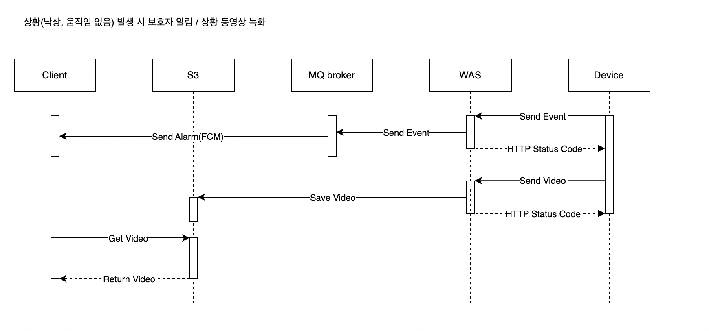
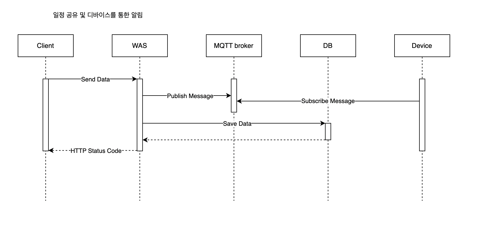
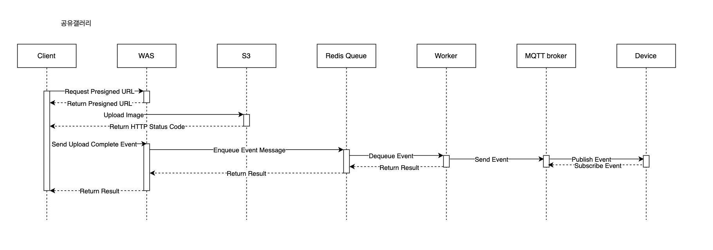

|앱 & 팀 이름|Hydor & 효도르 |
|:--:|:--|
|로고| |
|기간|2025. 03 ~ 2025. 06|
|수상|우수상 (3rd)|
|참여 인원|3명(iOS 개발 1명 + BE 1명 + AI/Embeded 1명)|

## 🔵 기획 의도
- SKT,LG,KT,NAVER 등 대기업에서 혼자 사는 노부모를 위해 자사 기기를 이용한 AI 서비스를 제공하고 있습니다.
- 하지만, 이러한 서비스는 국가 사업과 연관되어, 노부모들의 고독사 방지를 중점으로 운영합니다.
- Hyodor는 단순 고독사 방지를 목적이 아닌 지속적인 가족 유대감을 형성하여 같이 있는 듯한 사용자 경험을 주기 위해 기획했습니다.
- 이는 곧 현실적인 여건으로 같이 살지는 못하지만, 끈끈한 유대를 이어가고 싶은 가정에게 좋은 서비스를 제공한다고 생각합니다.

## 🔵 팀원 소개
||||
|:-:|:-:|:-:|
|김상준(iOS,팀장) [@kimsangjunzzang](https://github.com/kimsangjunzzang)|이재훈(BE) [@dlwogns](https://github.com/dlwogns)|민창기(AI,Embeded) [@min000914](https://github.com/min000914)|

## 🔵 프로젝트 구조

* 노부모 집에 간단하게 설치할 수 있는 디바이스를 제공합니다.

* 디바이스는 카메라, 스피커, 스크린이 탑재된 라즈베리파이5를 기반으로 합니다.

* 보호자는 어플을 통해 디바이스에 알람을 보내거나 사진을 공유할 수 있습니다.

* 알람을 설정할때 보호자가 직접 음성을 녹음할 수 있습니다.

* 공유된 사진은 디바이스의 스크린에 전시됩니다.

* 알람이 디바이스에서 울릴 때 녹음된 음성이 재생됩니다.

* 디바이스의 카메라를 통해 실시간 이상현상을 감지합니다.

* 이상현상이 감지되면 어플을 통해 알림을 주고 이상현상 당시의 동영상을 함께 전달합니다.

## 🔵 주요 기능

### 1. 공유 앨범 기능

등록된 보호자들이 함께 사용하는 가족 전용 공유 앨범 기능을 제공합니다. 

보호자가 업로드한 사진은 디바이스 화면에 자동으로 표시되며, 스마트기기가 친숙하지 않은 노부모는 아무런 조작 없이도 가족들의 사진을 바로 확인할 수 있습니다.

### 2. 노부모 일정 관리 및 메세지 기능

보호자가 어플에서 일정과 음성 파일을 등록하면 디바이스에서 해당 일정에 음성파일이 재생됩니다.

큰 글씨와 음성메모로 디바이스 조작이 어려운 노부모들도 가족들이 등록해준 알람을 받아볼 수 있습니다.

### 3. 이상 현상 감지 알림

디바이스에 설치된 카메라를 통해 노부모의 이상상황을 실시간으로 감지합니다.
현재 구현된 이상상황은 다음 두 가지 입니다.

1. 장시간(10분) 미움직임
2. 낙상

이상상황이 감지되면, 보호자에게 **FCM(Firebase Cloud Messaging)** 을 통해 즉시 알림과 함께 상황 영상을 전송합니다. 

이는 위험 상황에 대한 빠른 대처를 가능하게 하여 노부모의 안전을 실시간으로 지킬 수 있도록 합니다.

추가로 이상상황의 영상만을 전송하도록 하여 노부모의 사생활을 보호해주는 효과를 가집니다.

경량화된 Pose-Detecition 모델을 활용하여 라즈베리파이5라는 GPU가 없는 제한된 온디바이스에서 동작하도록 하여 서버의 부담을 줄입니다.

## 🔵 종설 백엔드 최종 정리

Oracle OpenJDK 17, Spring Boot 3.4.4

Redis(for Queue), Mosquitto, AWS SDK, RDS for MySQL

IntelliJ, DataGrip, Postman, RestDocs

Github for Version Control (Issue & PR)

## 🔵 API Document

http://54.172.64.98:8080/docs/index.html

## 🔵 시스템 아키텍쳐

## 🔵 시퀸스 다이어그램

# 🔵 세부 기능 내용

- **공유갤러리 기능 개발**

다수의 사용자가 하나의 갤러리를 공유하는 기능 구현

- S3를 활용하여 최소한의 비용으로 사진을 저장하고, CDN의 역할 또한 수행할 수 있도록 구현
- S3 Presigned URL을 사용하여 클라이언트가 직접 사진을 업로드 하여 서버로 사진을 이동하는 불필요한 통신 제거
- 다수 사용자 간 동기화 문제 해결을 위한 로직 구현

1. 동기화 로그 테이블을 생성하여 사용자 최종 갱신 시점 이후의 갱신 내역을 기반으로 업데이트 하도록 구현

2. Redis Queue를 사용하여 업로드 및 삭제 요청을 동기적으로 처리하도록 하여 동시성 문제 해결

- **Mosquitto MQTT 기반 서버 <-> IoT디바이스 pub/sub 개발**

라즈베리파이 기반 디바이스에 이벤트를 전송하기 위해 저전력 하드웨어를 위한 경량 메시지 서비스인 MQTT를 사용

서버를 Publisher, 라즈베리파이 디바이스를 Subscriber로 하여 공유갤러리 갱신 및 일정 알림시 디바이스에 실시간으로 알림이 전송되도록 구현

- **낙상 및 장시간 미움직임시 보호자 알림 기능 개발**

온디바이스 모델이 특정 이벤트 감지 시 보호자에게 알림이 가도록 개발

- 이벤트 수신 후 오류로 인해 사용자에게 알림이 가지 않는 경우가 치명적으로 생각하여 처리 실패시 로컬 큐에 저장하여 3회 재처리 하도록 구현

FCM을 활용하여 사용자 모바일 디바이스로 실시간 알림이 갈 수 있도록 구현
